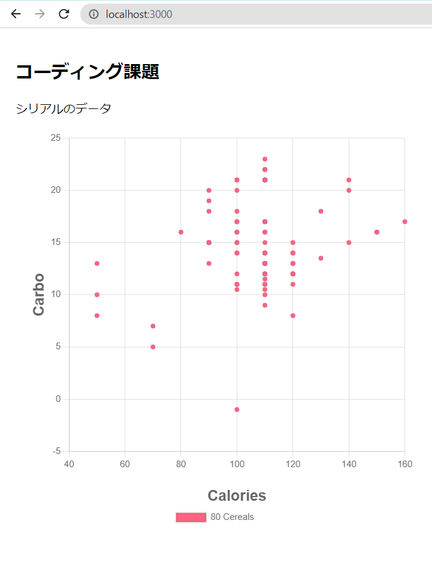

# Coding Test

- [日本語](./README.md)
- [English](./README-en.md)

## Overview

The assignment is to add one feature to the application.

Screenshot of the current application


Please confirm that this runs with LTS version of Node.js. 

### Assignment (Required): Allow users to change the axes of scatter plots

Modify codes to realize that the axes of the scatter plots can be changed arbitrarily.

Before the modification, the x-axis of the scatter plot is calories and the y-axis is carbo.

- Add a select box so that the user can select columns for the x-axis and y-axis.
- The scatterplot can be redrawn with the selected columns as axes.

List of target columns:
calories,protein,fat,sodium,fiber,carbo,sugars,potass,vitamins,shelf,weight,cups,rating

### Dataset

The dataset for this application is stored in `./data`.

- `./data/cereal.json` : Data returned when `GET /api/cereals`. This is converted from `cereal.csv` by a [tool](https://www.site24x7.com/ja/tools/csv-to-json.html).
- `./data/cereal.csv` : Original data

This dataset is downloaded from Kaggle.
For details on data, Please refer to the [description](https://www.kaggle.com/datasets/crawford/80-cereals)

License: CC BY-SA 3.0

### Assignment (Optional): Other improvements

If you did, it will be scored.

We assume that this application is for researchers to look at the data and notice the factors that make the `rating` high.
Please improve it for that purpose.

#### Example

1. There are 7 different mfrs. Draw a scatter plot using differnt colors for each mfr.
2. Show the serial name and details when users click a point.
3. Show the dataset as a table. 
4. Edit the data.
5. Refactor `window.onload` function to make it easier to read.
6. Support responsive design.
7. Change the implementation to use Next.js/React.js.

Proposals, not implementations, are also acceptable.

### How to execute

```bash
# Move to the root directory of this application

# Install modules
npm i

# Execute the application (with hot reload)
npm start
```

You can access <http://localhost:3000/> to get to the application.

### Packages

Node
- [Expressjs](https://expressjs.com/ja/): Web framework with Node
- [nodemon](https://www.npmjs.com/package/nodemon): For hot reload

CDN
- [Chartjs](https://www.chartjs.org/docs/latest/): For graph drawing
- [axios](https://github.com/axios/axios): HTTP client


## An example of Development environment

This is a summary of the development environment used by the QunaSys team.
If you can afford it, try building a Docker environment.

### Docker environment

Optionally, a Docker development environment is available.
You do not have to use this.

Our app development environment is basically prepared with Docker.
The Image for this app is using Nodejs LTS alpine from [dockerhub](https://hub.docker.com/_/node?tab=description).

#### Preparation of Docker

Prepare your Docker environment as you like.
Docker Desktop is preferred.

- Windows : [Windows に Docker Desktop をインストール](https://docs.docker.jp/docker-for-windows/install.html)
- Mac : [Mac に Docker Desktop をインストール](https://docs.docker.jp/docker-for-mac/install.html)

Also, for development in VSCode, extensions are also recommended.
[Visual Studio Code Remote - Containers](https://marketplace.visualstudio.com/items?itemName=ms-vscode-remote.remote-containers)
[Developing inside a Container](https://code.visualstudio.com/docs/remote/containers)

#### How to use Docker

```bash
# Launch Docker
docker-compose up -d

# Run app in containers
docker-compose exec npm start
```

You can access <http://localhost:3004/> to see the output.
Setting of port-forwarding is in `docker-compose.yml`.

```bash
# Stop Docker
docker-compose down
```